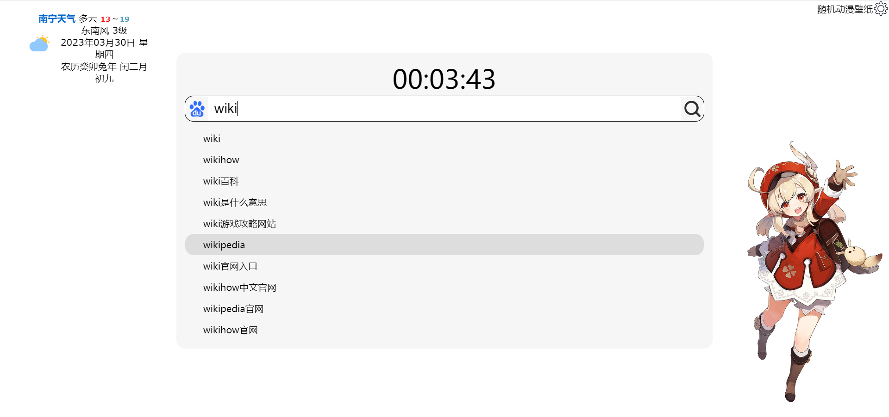

## Navigation

一个网站导航。

### 技术栈

框架：Vue3

库：day.js、lodash、Pinia

构建：Vue CLI（基于 Webpack、Yarn）

跨域：jsoup方案

### 截图

### 参考

https://github.com/suemor233/search-start-page

https://github.com/Dreamer-Paul/KStart

### 不足

- CSS真的是凭感觉弄的，没有页面的响应式。
- 对UI库、图标库了解少。
- 图片大部分是 直接从网上下载下来的，做法不够优雅。

